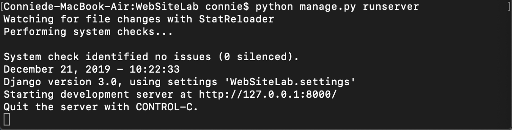

# WebSiteLab
說明
-----------
考量到此作業需要用到資料庫，Django可用makemigrations來建立與資料庫的中介檔(預設是sqlite)。
此專案由Python作為後端程式語言，運用Django框架，再搭配前端程式語言完成。

系統需求 
-----------
1. Python 3.0以上
2. Django
3. 若Windows系統執行有異狀，檢查sqliteDB.py，將/db.sqlite3 改為 \\db.sqlite3

安裝步驟(題目1跟2)
------------
1. 請先下載ＧitHub上所有檔案，於檔案位置開啟終端機，並執行 python manage.py migrate
 
2. 接著執行 python manage.py runserver 開啟server
 
3. 完成後開啟瀏覽器·並輸入 http://127.0.0.1:8000/login 即可進入 “登入介面”，如果登入失敗超過5次，等待30秒後才能繼續登入（第六次等待30^2秒）
 
4. 如要註冊，點擊頁面中超連結
 
5. 註冊並登入後，可以進入房地產頁面，此頁面可新增資料至sqlite，此外，admin權限者可以刪除，查詢，user及guest的資料及帳號，user能查詢本身與guest資料，guest只能查詢自己。
 

安裝步驟(題目3)
-------------
步驟1與步驟2跟上題一樣。
3. 完成後開啟瀏覽器·並輸入 http://127.0.0.1:8000/search 即可進入
 
4. 可根據需求不同勾選不同選項

心得
-------------
在接觸這個作業之前，我只有接觸過前端網頁設計，當初我也苦惱了很久到底要如何下手。
某次與同學閒聊時提起，剛好同學對網頁研究許多，給了我很大的方向，讓我大略認識了Django這個工具。
做這個作業過程中面臨到最大的困難不外乎就是對於前端與後端該如何連結，除了要不停地查資料，還要一面熟悉整個運作。
